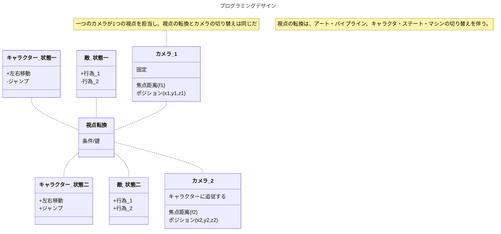

---
{"dg-publish":true,"dg-note-icon":"2","tags":["essay/Space"],"created":"2024-11-28","completed":null,"status":"进行","description":null,"cover":null,"permalink":"/900.Publish/デジタルゲームにおける「視覚空間」デザイン研究：＜多視点＞の表現技法を中心に/","dgPassFrontmatter":true,"noteIcon":"2"}
---

**キーワード：** デジタルゲーム 空間 視点
## 研究背景
中国の作家、蘇軾（そしょく）は「西林の壁に題す」[^1]という詩の中で「橫より看れば嶺を成し側よりすれば峰を成す、遠近高低各同じからず」に書いている。山を正面と横から、遠くと近くから、そしてミクロとマクロから見ることはすべて異なり、視点が空間表現に与える影響を解釈できた。詩の後半「橫廬山の真面目を識らざるは、只身の此の山中に在るに縁る」は山の奥にいる人は、視点不変のため、山の本当の姿を見ることができない。

視点はゲーム空間を構成するもっとも根本的な基点となる。現在のゲームにおいて、リアルな三次元を再現できるシングル視点のゲームを目指し、多視点のゲームは少ない。ゲームプレイ面では、複数の視点は複数のスクロールを使われる必要があり、複数のカメラを頻繁に転換する必要があることである。美術面では、異なる視点を異なる美術をデザインする必要がある。多視点のゲームはシングル視点のゲームに比べて難易度が高い。

## 先行研究
吉田寛教授の論文「ビデオゲームにとって「リアルな空間」とは何か？——第三の次元の表現技法を中心に」[^2]では、3DCG技術が開発される以前、デザイナーがスクリーンで「擬似3D」という表現技法をまとめている。 これらの空間表現はリアルを再現するためにデザインされたものであるが、視点の違いによって異なる画面を表現し、異なるゲームプレイを提供した結果、多種多様なゲームを制作された。

|  |  |
| -------------------------------------------------------------------- | -------------------------------------------------------------------- |
*（『FINAL FANTASY』，2021）*

|  |  |
| -------------------------------------------------------------------- | -------------------------------------------------------------------- |
*（『OCTOPATH TRAVELER』，2019）*

上記の2つのゲームを例にとると、当時の技術では限界があったため、多くのRPGゲームは、探索と戦闘の視点を別々にデザインし、異なるゲームプレイに対応させたものだ。しかし、技術の進歩に従って、このような妥協的なデザインは徐々に排除されていって、複数の視点を持つゲームデザインも可能になった。

#### 『The Plucky Squire』
『The Plucky Squire』は多視点ゲームである。キャラクターは絵本のような2D空間と3D空間を転換できる。スクロールが変わることで、異なる空間は相互作用ができる。また、曲面やページをめくるレベルなどの特殊なデザインを使用することで、スクロールの規則を破っている。また、絵本の部分を3D世界に配置することで、さまざまな視点からリアルな光と影を感じることができる。ゲームの表現力を高めると同時に、物語ともうまく融合させる。

|  |  |  |
| -------------------------------------------------------------------- | -------------------------------------------------------------------- | -------------------------------------------------------------------- |
|  |  |  |
|  |  |  |
|  |  |  |
*（『The Plucky Squire』，2024）*

#### 『Evoland』
ゲーム『Evoland』は、グラフィックや操作の変化などによって、ゲーム技術の進化を反映される。例えば、ゲームの初めでは、プレイヤーは左右の動きしかできず、画面はトップビューとピクセルスタイルで表現される。後半になると、今流行する三人称視点と3DCGに変わり、操作も複雑になる。プレイヤーは自由に視点を変えることはできないが、異なる視点でゲームプレイの雰囲気を感じられる。

|  |  |  |
| -------------------------------------------------------------------- | -------------------------------------------------------------------- | -------------------------------------------------------------------- |
|  |  |  |
*（『Evoland』，2013）*

## 研究内容
本研究は、多視点ゲームの4つの難点を中心とした研究し、視点の転換とそれに関連する表現を中心としたゲームを制作したいと考えている。
### プログラミングデザイン
多視点に対応するプログラミングは、単一視点に比べて複雑で、視点の切り替えに対応する必要もある。

### 企画で視点転換の合理性
多視点ゲームには、没入感を与えるための適切なストーリーが必要だ。以前のRPGのように、ゲームプレイだけで視点を変えざるを得ないようでは、研究価値はない。この難点は二つ方向から構想すると考える。
1. 『The Plucky Squire』のように、本などのような媒体に頼って、次元を転換する物語を書く。
2. 登場人物に焦点を当てるのではなく、プレイヤーが操作する対象は環境に設定されている。

### 異なる視点でアートパイプラインのデザイン
多視点ゲームの美術表現を豊かにするために、視点ごとに異なるアートパイプラインをデザインすることができる。アートパイプラインのデザインは、個性と統一感を両立するようにデザインする必要がある。

### 複数のカメラワーク

## 研究目的
**本研究は、ゲーム空間における多視点の研究とデザインを通じて、ゲームの面白さを高めるのである。**

ゲームの空間は、プレーヤーがゲームを体験するための基盤である。カントは『純粋理性批判』[^3]でゲームの空間は、経験から抽出されて得られたものではなく、経験に先立って存在するものであると述べた。そのため、プレイヤーがゲームを認識するとき、まずゲームの空間から認識する。ゲーム空間の根本的な基点として、視点を変えることでより多くの可能性が生まれ、ゲーム体験が豊かになる。ゲーム空間をさまざまな視点から見ることができ、キャラクターから空間へと意識が広がり、視野が広がる。

## 研究意義
デジタルゲームは独自の方法で「空間」を作り出してきた。今のゲームは、ゲーム空間を360度見ることができながら、やはり人間の視点に立ったものである。ゲームは体験者の主観的な感情を刺激することが多い。異なる視点でゲームを体験できれば、「橫廬山の真面目を識らざるは、只身の此の山中に在るに縁る」のように、ゲームデザイナーが伝えようとしていることの本質が見えてくるかもしれない。

## 研究方法

- 一年前期：文献やゲーム例をもとに、異なる視点の特徴を研究する；制作に対応できるよう、幅広い美術を試す。
- 一年后期：研究に基づいて企画を立てる；研究内容の予想難点を解決する。

- 二年前期：作品制作。
- 二年后期：作品改善；研究まとめ；制作まとめ。

[^1]: [蘇軾，西林の壁に題す](https://chinese.hix05.com/sushi/sushi_3/sushi303.seirin.html)
[^2]: 吉田寛，[[ビデオゲームにとって「リアルな空間」とは何か？——第三の次元の表現技法を中心に.pdf|ビデオゲームにとって「リアルな空間」とは何か？——第三の次元の表現技法を中心に]]
[^3]: イマヌエル・カント，纯粹理性批判
