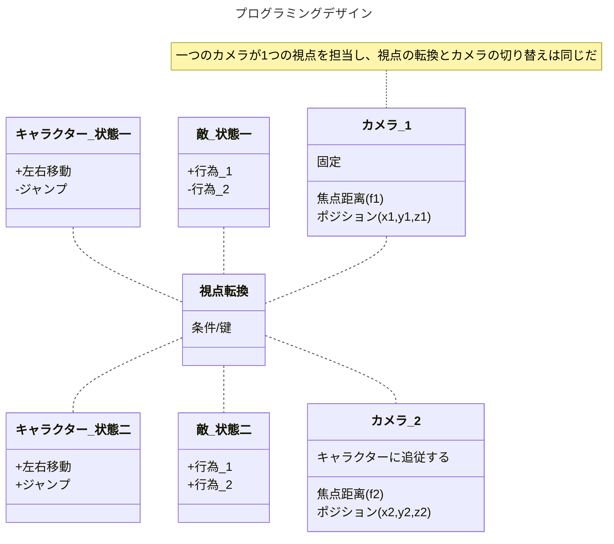
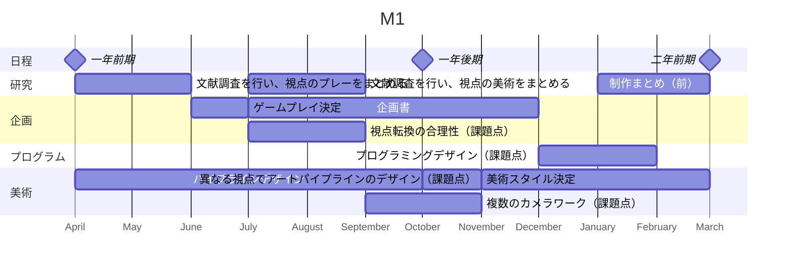

---
{"dg-publish":true,"dg-note-icon":"2","tags":["essay/Space"],"created":"2024-11-28","completed":null,"description":"視点はゲーム空間を構成するもっとも根本的な要素である。現代にあるゲームはリアルな三次元を再現するシングル視点のゲームが多い。このようなゲームは現実世界を認識すると同じように、個人的な視点からだけでは全体性に欠けることが多い。また、全体像を見る際に個人的な感情を見落としがちである。デジタルゲームは、現実世界では見えにくい視点で、ストーリーやゲームプレイを提供することができ、デジタルゲームにおける＜多視点＞の表現が可能になる。同時に、多視点がもたらすゲームシステムの複雑さは、かつてない挑戦である。私は、プログラミングデザイン、視点転換の合理性、異なる視点でアートのデザイン、複数のカメラワーク、以上四つの課題点から研究を展開したいと考えてる。このような研究を通して、より良く、面白いゲーム体験を創出するという目的を達成したいである。また、2年間で勉強・研究したものを集大成し、修了成果として、多視点から観察を促すゲームを作る予定である。","cover":null,"permalink":"/900.Publish/デジタルゲームにおける「視覚空間」デザイン研究：＜多視点＞の表現技法を中心に/","dgPassFrontmatter":true,"noteIcon":"2"}
---

**キーワード：** デジタルゲーム 空間 視点
## 研究背景
中国の作家、蘇軾（そしょく）は「西林の壁に題す」[^1]という詩の中で「橫より看れば嶺を成し側よりすれば峰を成す、遠近高低各同じからず」に書いている。山は正面と横から、遠くと近くから、そしてミクロとマクロから見ることはすべて異なり、それが視点と空間表現の影響を解釈かできている。詩の後半「橫廬山の真面目を識らざるは、只身の此の山中に在るに縁る」は山の奥にいる人は、視点が変わらないのため、山の本当の姿を見ることができない。

視点はゲーム空間を構成するもっとも根本的な要素である。現代にあるのゲームはリアルな三次元を再現するシングル視点のゲームが多く一方、多視点のゲームは少ない。複数の視点は多様なスクロールを使う必要があり、複数のカメラを頻繁に転換する。また、異なる視点を異なる背景やデザインを制作する必要がある。多視点のゲームはシングル視点のゲームに比べて、制作のハードルが高い。

## 先行研究
吉田寛は「ビデオゲームにとって「リアルな空間」とは何か？——第三の次元の表現技法を中心に」[^2]では、3DCG技術が開発される以前、デザイナーがスクリーンで「擬似3D」と述べた。 これらの空間表現はリアルを再現するためにデザインされたものであるが、視点の違いによって異なる画面を表現し、異なるゲーム体験を提供した結果、多種多様なゲームを制作された。

|  |  |
| ------------------------------------------------------------------------ | ------------------------------------------------------------------------ |
*（『FINAL FANTASY』，2021）*

|  |  |
| -------------------------------------------------------------------- | -------------------------------------------------------------------- |
*（『OCTOPATH TRAVELER』，2019）*

上記の2つのゲームを例にとると、当時の技術では限界があったため、多くのRPGゲームは、異なるシーンの体験に対応できるよう、探索と戦闘の視点を別々にデザインした。しかし、技術の進歩により、このような妥協的なデザインは徐々に排除され、複数の視点を持つゲームデザインも可能になった。

#### 『The Plucky Squire』
『The Plucky Squire』は多視点ゲームで、キャラクターは絵本のような2D空間と3D空間を転換できる。スクロールが変わることで、異なる空間は相互作用ができる。また、曲面やページをめくるレベルなどの特殊なデザインを使用することで、スクロールのルールを破っている。また、絵本を三次元の世界観に配置することで、さまざまな視点からリアルな光と影を感じることができる。ゲームの表現力を高めると同時に、物語ともうまく融合させる。

|  |  |  |
| -------------------------------------------------------------------- | -------------------------------------------------------------------- | -------------------------------------------------------------------- |
|  |  |  |
|  |  |  |
|  |  |  |
*（『The Plucky Squire』，2024）*

#### 『Evoland』
『Evoland』は、グラフィックや操作の変化などによって、ゲーム技術の進化を反映するゲームである。例えば、最初のデジタルゲームは、左右の動きしかできず、画面はトップビューとピクセルスタイルで表現される。ゲームを進めると、今流行ている第三人称視点と3DCGに変わり、操作も複雑になる。プレイヤーは自由に視点を変えることはできないが、異なる視点でゲームプレイの雰囲気を感じられる。

|  |  |  |
| -------------------------------------------------------------------- | -------------------------------------------------------------------- | -------------------------------------------------------------------- |
|  |  |  |
*（『Evoland』，2013）*

## 研究内容
本研究は、以下4つの課題点を中心とし、他視点のゲームを研究し、視点の転換とそれに関連する表現を中心としたゲームを制作したいと考えている。
### プログラミングデザイン
多視点に対応するプログラミングは、単一視点に比べて複雑で、視点の切り替えに対応する必要もある。
視点の転換は、アート・パイプライン、キャラクタ・ステート・マシンの切り替えを伴う。

### 視点転換の合理性
適切なストーリーはゲーム体験における不可欠なものである。ゲームプレイだけで視点を変えざるを得ないことではなく、ストーリーの進行により自然に視点転換することになる。二つの方向から、この課題を組みたいと考える。
1. 『The Plucky Squire』のように、本などのような媒体を通し、次元を転換する物語を書く。
2. 登場人物に焦点を当てるのではなく、プレイヤーが操作する対象は環境に設定する。

### 異なる視点でアートパイプラインのデザイン
多視点ゲームの美術表現を豊かにするために、視点ごとに異なるアートパイプラインをデザインし、個性と統一感を両立する必要がある。

### 複数のカメラワーク

## 研究目的
**本研究は、ゲーム空間における多視点の研究とデザインを通じて、より良く、面白いゲーム体験を創出することである。**

ゲームの空間は、プレーヤーがゲームを体験するための基盤である。カントは『純粋理性批判』[^3]でゲームの空間は、経験から抽出されて得られたものではなく、経験に先立って存在するものであると述べた。そのため、プレイヤーがゲームを認識するとき、まずゲームの空間から認識する。ゲーム空間を根本的な原点とし、視点を変えることでより多くの可能性が生まれ、ゲーム体験が豊かになる。ゲーム空間をさまざまな視点から見ることができ、キャラクターから空間へと意識が広がり、視野が広がる。

## 研究意義
デジタルゲームは独自の方法で「空間」を作り出してきた。今のゲームは、ゲーム空間を360度見ることができながら、人間の視点に立ったものである。ゲームは体験者の主観的な感情を刺激することが多い。異なる視点でゲームを体験できれば、「橫廬山の真面目を識らざるは、只身の此の山中に在るに縁る」のように、ゲームデザイナーが伝えようとしていることの本質が見えてくるかもしれない。

## 研究方法

- 一年前期：文献調査を行い、今までのゲームの視点に関し、それぞれの特徴を整理、分類する。
- 一年后期：ゲームの視点転換について、試作を行う。

- 二年前期：一年の研究成果に基づき、ゲーム制作の企画を立ち、制作を始める。
- 二年后期：完成した作品でテストを行い、フィードバックにより修正、改善する。また、研究成果を論文にまとめる。

[^1]: [蘇軾，西林の壁に題す](https://chinese.hix05.com/sushi/sushi_3/sushi303.seirin.html)
[^2]: 吉田寛，[[ビデオゲームにとって「リアルな空間」とは何か？——第三の次元の表現技法を中心に.pdf|ビデオゲームにとって「リアルな空間」とは何か？——第三の次元の表現技法を中心に]]
[^3]: イマヌエル・カント，纯粹理性批判
