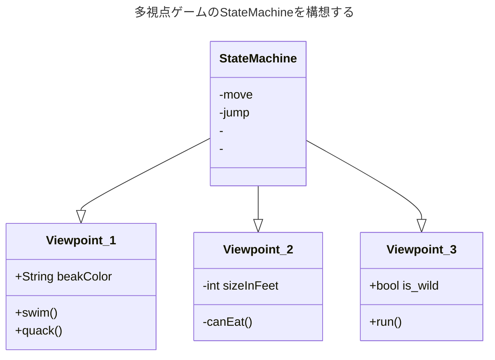

---
{"dg-publish":true,"dg-note-icon":"2","tags":["essay/Space"],"created":"2024-11-28","completed":null,"status":"进行","description":null,"cover":null,"permalink":"/900.Publish/デジタルゲームにおける「視覚空間」デザイン研究：＜多视点＞の表現技法を中心に/","dgPassFrontmatter":true,"noteIcon":"2"}
---

# デジタルゲームにおける「視覚空間」デザイン研究：＜多视点＞の表現技法を中心に
**キーワード：** デジタルゲーム 空間 视点
## 研究背景
中国の作家、蘇軾（そしょく）は「西林の壁に題す」[^1]という詩の中で「橫より看れば嶺を成し側よりすれば峰を成す、遠近高低各同じからず」に書いている。山を正面と横から、遠くと近くから、そしてミクロとマクロから見ることはすべて異なり、視点が空間表現に与える影響を解釈できる。詩の後半「橫廬山の真面目を識らざるは、只身の此の山中に在るに縁る」は山の奥にいる人は、視点不変のため、山の本当の姿を見ることができない。

視点はゲーム空間を構成するもっとも根本的な基点となる。現在のゲームにおいて、リアルな三次元を再現できるシングル視点のゲームを目指し、多視点のゲームは少ない。ゲームプレイ面では、複数の視点は複数のスクロールを使われる必要があり、複数のカメラを頻繁に転換する必要があることである。美術面では、異なる視点を異なる美術をデザインする必要がある。多視点のゲームはシングル視点のゲームに比べて難易度が高い。

## 先行研究
吉田寛教授の論文「ビデオゲームにとって「リアルな空間」とは何か？——第三の次元の表現技法を中心に」[^2]では、3DCG技術が開発される以前、デザイナーがスクリーンで「擬似3D」という表現技法をまとめている。 これらの空間表現はリアルを再現するためにデザインされたものであるが、視点の違いによって異なる画面を表現し、異なるゲームプレイを提供した結果、多種多様なゲームを制作された。
==RPG游戏虽然有的游戏将探索和战斗部分的空间分别设计，玩法和视点都发生了改变，但是是妥协而非主动设计，有以下这些是自然且美的设计==

|  |  |
| -------------------------------------------------------------------- | -------------------------------------------------------------------- |
*（『FINAL FANTASY』，2021）*

|  |  |
| -------------------------------------------------------------------- | -------------------------------------------------------------------- |
*（『OCTOPATH TRAVELER』，2019）*

#### 『The Plucky Squire』
『The Plucky Squire』は多視点ゲームである。キャラクターは絵本のような2D空間と3D空間を転換できる。スクロールが変わることで、異なる空間は相互作用ができる。また、曲面やページをめくるレベルなどの特殊なデザインを使用することで、スクロールの規則を破っている。また、絵本の部分を3D世界に配置することで、さまざまな視点からリアルな光と影を感じることができる。ゲームの表現力を高めると同時に、物語ともうまく融合させる。

|  |  |  |
| ---------------------------------------------- | ---------------------------------------------- | ---------------------------------------------- |
|  |  |  |
|  |  |  |
|  |  |  |
*（『The Plucky Squire』，2024）*

#### 『Evoland』
在游戏『Evoland』中，玩家随着游戏的流程不断解锁高次元的操作和画面，从中体现游戏的进化。其中的「进化」涉及前文所提到的スクロール和CG表现，从一开始トップビュー视点的像素美术风格，只允许玩家有限的移动。到游戏后期的クオータービュー，解锁高维度的操作方法（比如跳跃）。通过玩法和画面展示游戏史的发展进程。玩家虽然不能主动改变视点，但也能从游戏中感受到不同视点下游戏玩法的魅力。
ゲーム『Evoland』では、ゲームの進行に応じて高次元の操作やグラフィックがアンロックされ続け、そこからゲームが進化していく。 その 「進化 」には、先に述べたスクロールやCGの演出も含まれ、序盤のトップビュー視点のピクセルアート的なものから、限られた動きしかできないものへと変化していく。 ゲーム後半になるとクオータービューとなり、高次元の操作方法（ジャンプなど）がアンロックされる。 ゲームの歴史の進行は、ゲームプレイとグラフィックで示される。 プレイヤーは積極的に視点を変えることはできないが、視点を変えることでゲームプレイの雰囲気をつかむことができる。

|  |  |  |
| -------------------------------------------------------------------- | -------------------------------------------------------------------- | -------------------------------------------------------------------- |
|  |  |  |
*（『Evoland』，2013）*

## 研究内容
本研究は、多視点ゲームの3つの難点を中心とした研究し、視点の転換とそれに関連する表現を中心としたゲームを制作したいと考えている。
##### 1. プログラミングにつぃて
多视点游戏需要搭配多套状态机，同时视点转换时状态机也要同步切换。

##### 2. 企画につぃて：物語で視点転換の合理性
多视点游戏需要合适的故事给玩家制造代入感。

##### 3. 美術につぃて：異なる視点でのパイプラインの統一性
为了丰富多视点游戏的表现力，不同视点可以设计不同的美术管线。美术管线设计上同时要兼顾个性和统一。

多视点转换功能也需要镜头调度的配合。

## 研究目的
本研究は、ゲームにおける多視点の研究とデザインを通じて、# ゲームの面白さを高めるのである。

ゲームの空間は、プレーヤーがゲームを体験するための基盤である。カントは『純粋理性批判』[^3]でゲームの空間は、経験から抽出されて得られたものではなく、経験に先立って存在するものであると述べた。そのため、プレイヤーがゲームを認識するとき、まずゲームの空間から認識する。作为游戏空间的设计源头，改变视点可以带来更多的可能性，丰富游戏的体验。

将玩家的注意力从角色扩展到游戏环境当中。

## 研究意義
ビデオゲームがい かに独自の方法で「空間」を作り出してきた。基于不同视点制作的游戏空间，相对于追求真实系游戏更加专注于游戏主题的表达。
多视点游戏的空间对游戏业界
对玩家

## 研究方法

- 一年前期：
- 一年后期：

- 二年前期：
- 二年后期：

[^1]: [題西林壁：蘇軾](https://chinese.hix05.com/sushi/sushi_3/sushi303.seirin.html)
[^2]: 吉田寛，[[ビデオゲームにとって「リアルな空間」とは何か？——第三の次元の表現技法を中心に.pdf|ビデオゲームにとって「リアルな空間」とは何か？——第三の次元の表現技法を中心に]]
[^3]: 伊曼努尔·康德，纯粹理性批判
